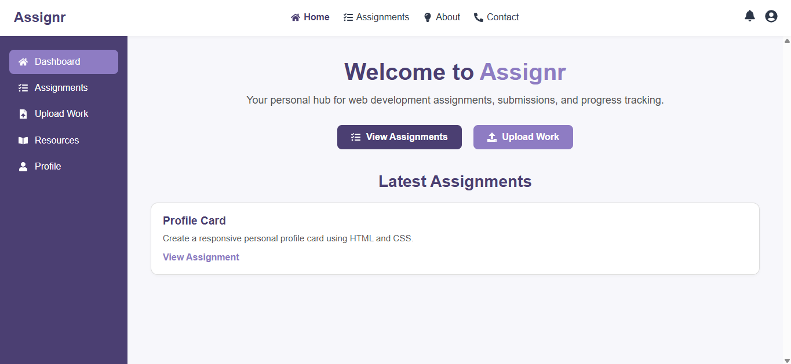

# 📝 Assignr

Assignr is a simple and clean React-based assignment management platform. It's designed to help students — especially beginners in web development — receive, complete, and upload assignments in HTML, CSS, JavaScript, and React.  

Whether you're a teacher assigning tasks or a student practicing frontend skills, Assignr is the lightweight dashboard you need.

---

## 📸 Preview

---

## 🚀 Features

- 📂 View available assignments with descriptions and download links
- 💾 Upload your completed work
- 📬 Contact form to reach out with suggestions or requests
- 📚 Resource page with helpful learning links and videos
- ⚙️ Built using React, Tailwind CSS, and Framer Motion

---

## 🔧 Tech Stack

| Tech         | Purpose                                |
|--------------|----------------------------------------|
| React        | Frontend framework                     |
| React Router | Navigation and page routing            |
| Tailwind CSS | Utility-first styling                  |
| Framer Motion| Animations and transitions             |
| React Icons  | Icon support throughout the UI         |

---

## 📁 Folder Structure (simplified)

